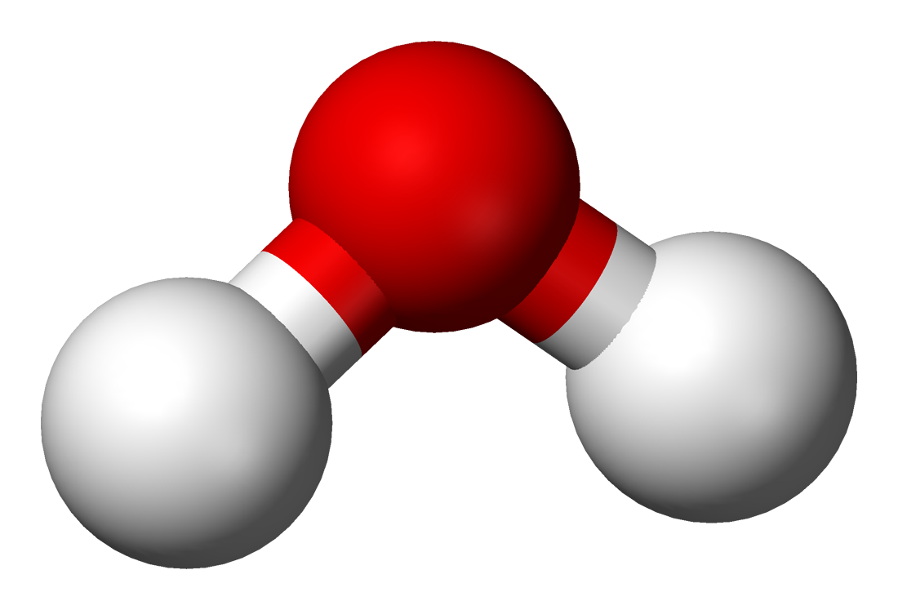

Molecular System
################
To begin a calculation with MoHa, the first step is to build a Hamiltonian of a 
system, either molecular system or model system. In most cases, we need to build a molecular
system

In terms of second quantisation operators, a general Hamiltonian can be written
as 

.. math::
        H = - \sum_{ij} t_{ij}\hat{c}^{\dagger}_{i}\hat{c}_{j} + \frac{1}{2} \sum_{ijkl}
        V_{ijkl}\hat{c}^{\dagger}_{i}\hat{c}^{\dagger}_{k}\hat{c}_{l}\hat{c}_{j}

The construction of molecular Hamiltonian usually set up in three steps. 

- First, construct a molecular geometry. 
- Second, generate a Gaussian basis set for the molecular.
- Finally, compute all kinds of one body terms and two body terms with that basis
  to define a Hamiltonian.

 
Molecular Geometry
==================
Molecule is a system consist with nucleus and electrons. For quantum chemistry
calculation in MoHa, we will always used the Born-Oppenheimer approximation, which assumption
that the motion of atomic nuclei and electrons in a molecule can be separated

.. math::
    \Psi_{molecule} = \psi_{electronic} \otimes \psi_{nuclear}

The module ``molecule`` in MoHa actually only contains imformation of the
nuclear. To build a water molecule with MoHa,  we can specifythe molecular object by load the molecular geometry from .xyz file.

.. code-block:: text

    3
    water
    8   0.0000000000	-0.143225816552		0.0000000
    1   1.638036840407	1.136548822547		-0.000000000000
    1   -1.638036840407	1.136548822547		-0.000000000000

.. code-block:: python

    mol = IOSystem.from_file('water.xyz')

Basis Set
=========
MoHa supports basis sets consisting of generally contracted Cartesian Gaussian
functions. MoHa is using the same basis set format as NWChem, and the basis sets can be downloaded from the EMSL webpage (https://bse.pnl.gov/bse/portal).

STO-3G EMSL basis set of hydrogen and oxygen:

.. code-block:: text

    #  STO-3G  EMSL  Basis Set Exchange Library  8/21/18 3:24 AM
    # Elements                             References
    # --------                             ----------
    #  H - Ne: W.J. Hehre, R.F. Stewart and J.A. Pople, J. Chem. Phys. 2657 (1969).
    # Na - Ar: W.J. Hehre, R. Ditchfield, R.F. Stewart, J.A. Pople,
    #          J. Chem. Phys.  2769 (1970).
    # K,Ca - : W.J. Pietro, B.A. Levy, W.J. Hehre and R.F. Stewart,
    # Ga - Kr: J. Am. Chem. Soc. 19, 2225 (1980).
    # Sc - Zn: W.J. Pietro and W.J. Hehre, J. Comp. Chem. 4, 241 (1983) + Gaussian.
    #  Y - Cd: W.J. Pietro and W.J. Hehre, J. Comp. Chem. 4, 241 (1983). + Gaussian
    #   

    BASIS "ao basis" PRINT
    #BASIS SET: (3s) -> [1s]
    H    S
        3.42525091             0.15432897       
        0.62391373             0.53532814       
        0.16885540             0.44463454       
    #BASIS SET: (6s,3p) -> [2s,1p]
    O    S
        130.7093200              0.15432897       
        23.8088610              0.53532814       
        6.4436083              0.44463454       
    O    SP
        5.0331513             -0.09996723             0.15591627       
        1.1695961              0.39951283             0.60768372       
        0.3803890              0.70011547             0.39195739       
    END

Hamiltonian
==========
To build a Hamiltonian object, MoHa can load the molecular geometry and and basis from file
format.

.. code-block:: python

    mol,orbs = IOSystem.from_file('h2o.xyz','sto-3g.nwchem')
    ham = Hamiltonian.build(mol,orbs)

Hamiltonian object has attributes of different operators use the following
conventions for variable names. The following are defined by setting up the
Hamiltonian by default:

* ``ham.operators['nuclear_repulsion']``
    :class:`.ZeroElectronOperator` object with the nuclear repulsion energy integrals.
* ``ham.operators['overlap']``
    :class:`.OneElectronOperator` object with the overlap integrals.
* ``ham.operators['kinetic']``
    :class:`.OneElectronOperator` object with the kinetic energy integrals.
* ``ham.operators['nuclear_attraction']``
    :class:`.OneElectronOperator` object with the nuclear attraction integrals.
* ``ham.operators['electron_repulsion']``
    :class:`.TwoElectronOperator` object with the electron repulsion integrals.

They offer the key ingredient for the following calculations.
